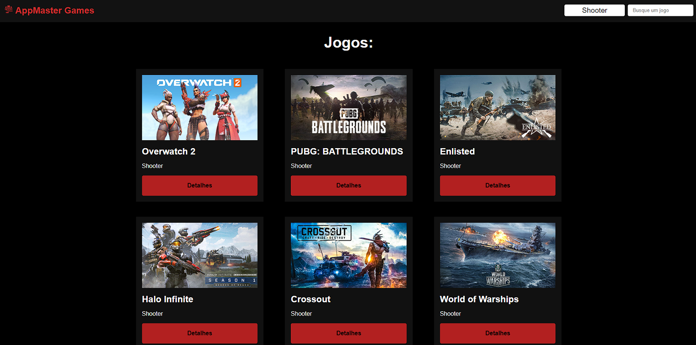
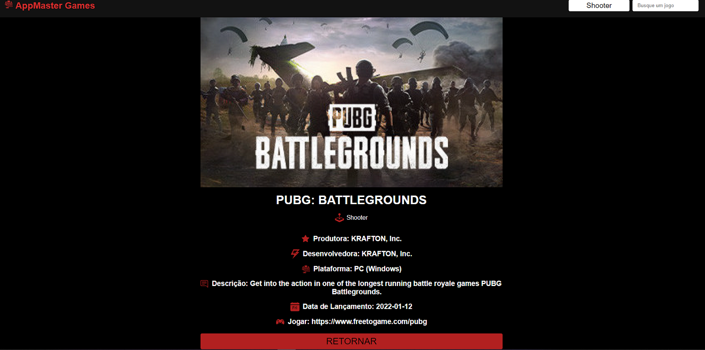
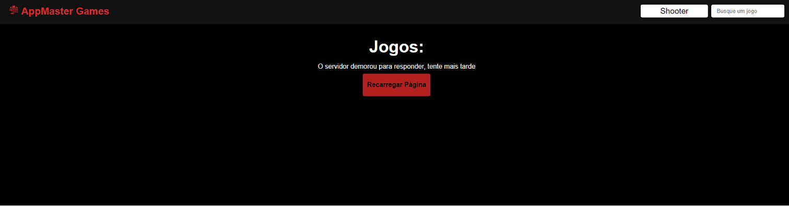
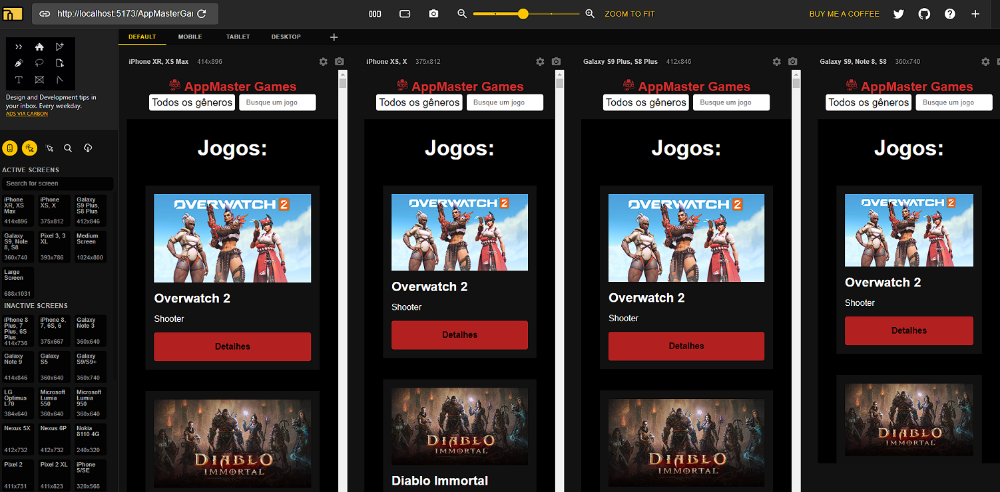

<h1 align="center">
   
    
   
    Projeto de Estágio Frontend React
   
</h1>

<h4 align="center">Uma simples aplicação CRUD feito com <a href="https://pt-br.reactjs.org/" target="_blank">React</a></h4>

  <a href="https://andykallian.github.io/codeleap-engineering-test" target="_blank">Realtime</a> •
  <a href="#desafio">Desafio</a> •
  <a href="#ferramentas">Ferramentas</a> •
  <a href="#autor">Autor</a>

## Desafio
* Uma aplicação que deve permitir ao usuário receber uma lista de jogos, e filtrar essa lista tanto pelo genero do jogo, quanto pelo título específico.
* A estrutura de pastas é:
* > **/actions** *responsável pelo fetch dos dados*
* > **/components** *componentes estilizados*
* > **/context** *gerenciar os estados da lista de jogos filtrada pelo usuário*
* > **/pages** *as páginas que direcionarão o usuário através da aplicação*
* Hooks ([React Functional Components](https://pt-br.reactjs.org/docs/components-and-props.html)) ao invés de classes
* É capaz de lidar com erros vindos da API e fornecer uma mensagem para o usuário recarregar a página

## Ferramentas
Essa aplicação foi feita utilizando os seguintes pacotes:

##### Core.
- [React](https://pt-br.reactjs.org/) (Principal "framework")

##### Estilização.
- [Styled Components](https://styled-components.com/) (CSS in JS / TS)

##### API CRUD e tratamento de dados.
- [Axios](https://axios-http.com/ptbr/docs/intro) (Requisições API e funcionalidades para o CRUD)
- [React Spinners](https://www.npmjs.com/package/react-spinners) (Pacote com alguns spinners de loadings)

##### Formatador de Código e outras ferramentas de desenvolvimento.
- [ESLint](https://highlightjs.org/) (Javascript [linter](https://sourcelevel.io/blog/what-is-a-linter-and-why-your-team-should-use-it))
- [Prettier](https://prettier.io/)

## Autor
**feito por Anderson Viana**

**SERÃO BEM VINDOS TODAS AS SUGESTÕES E FEEDBACK! 💪**